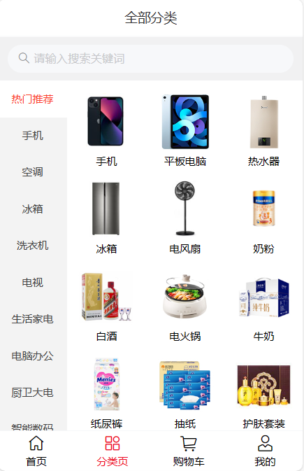
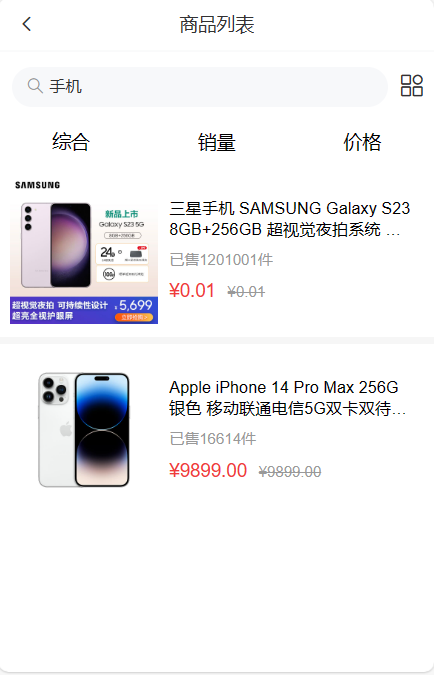
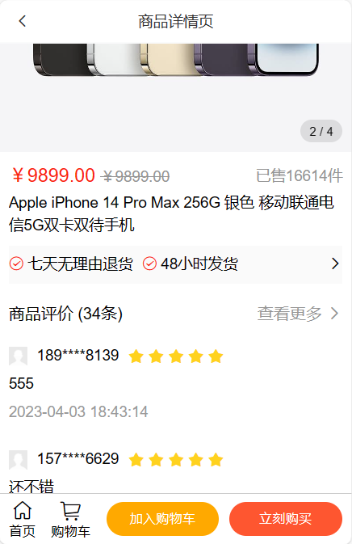
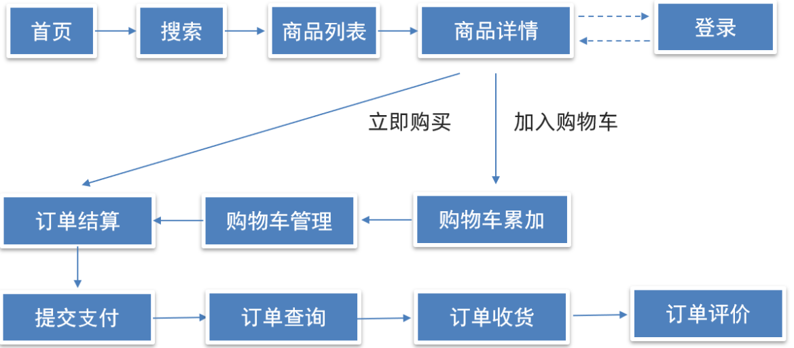

# hm-shopping
 移动端购物App

演示：[移动购物](https://1941289645.github.io/hm-shopping/)（打开浏览器控制面板切换页面尺寸）

## 项目展示：

首页：

商品分类页：

搜索列表页：

商品详情页：

……

## 功能模块

## 项目包含技术

| 完整电商购物业务流  |     组件库vant      |  移动端vw适配   |
| :-----------------: | :-----------------: | :-------------: |
| request请求方法封装 | storage存储模块封装 | api请求模块封装 |
|   请求响应拦截器    |    嵌套路由配置     |  路由导航守卫   |
|    路由跳转传参     | vuex分模块管理数据  |  项目打包&优化  |

## 目录文件介绍：

……
